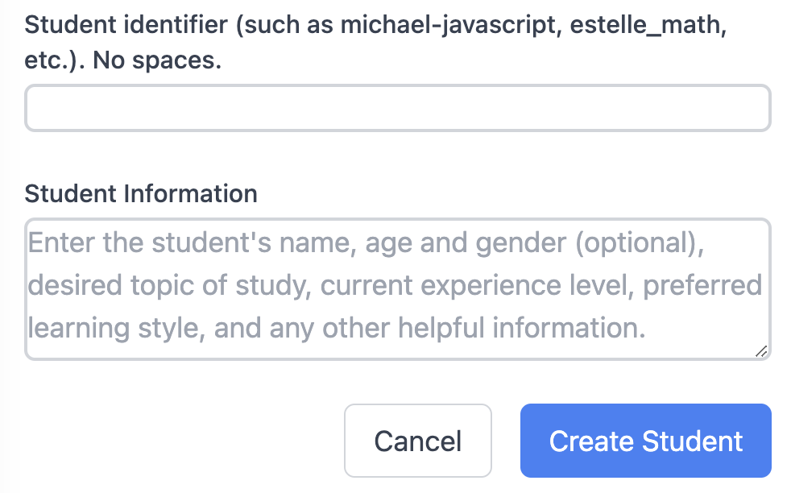
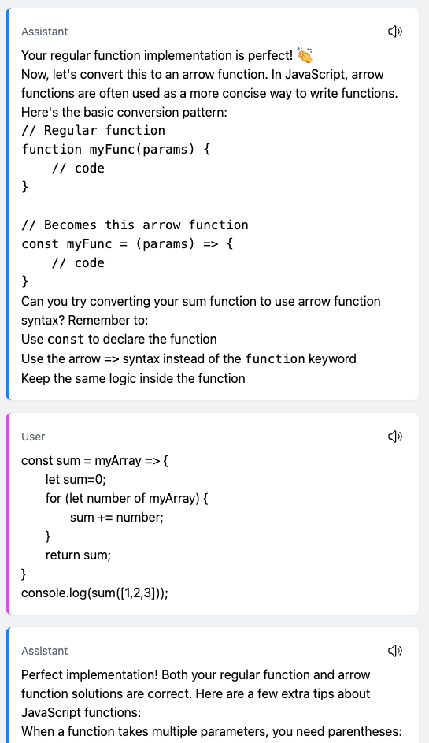

# Seneca-tutor

Large language model-based tutoring app that runs locally with a web interface using Flask and the Anthropic API.

## Why

An ideal tutor would have wide-ranging subject matter knowledge, an ability to adapt the material to the student's knowledge and learning style, and the discipline to design an effective long-term lesson plan. We can achieve much of this by giving a LLM access to specialized memory files that it can access and keep updated across chat sessions.

## Features

- The AI continuously updates the lesson plan based on progress and how the student is doing, and remembers it between sessions
- The AI has access to a calculator tool for checking arithmetic problems
- Uses Claude 3.5 Sonnet model

## Demo

1. User adds a student:



Student enters: Experienced Python programmer, wants to learn basics of JavaScript/TypeScript for webdev like Node.js

2. Tutor creates a lesson plan (condensed plan shown here):

```
Short-term goals:
- Master JavaScript syntax differences from Python
- Understand JavaScript's type system and TypeScript basics
- ...

Long-term goals:
- Develop proficiency in Node.js backend development
- ...

Topics to cover (in order):
1. JavaScript Syntax and Key Differences
   - Variable declarations (let, const, var)
   - Function syntax (regular, arrow functions)
   - Object and array syntax
   - Template literals
2. ...
```
3. Excerpt from tutoring session:



4. Tutor adds to its lesson plan memory:
```
Learning observations:
- Quick to grasp basic function syntax
- Successfully transitioned from Python-style to JavaScript syntax with guidance
- Shows good understanding of loops and variable manipulation
- Could benefit from exposure to JavaScript-specific array methods like reduce
```

## Prerequisites

- Anthropic API key
  - Set environment variable ANTHROPIC_API_KEY=your_api_key_here (or put it in a .env file in the seneca-tutor directory)
  - Get an API key at https://console.anthropic.com/
- Python 3
- Tested on Mac and Linux

## Installation

1. Clone this repository:

```bash
git clone https://github.com/MGensheimer/seneca-tutor.git
cd seneca-tutor
```

2. Create a virtual environment (recommended):

```bash
python -m venv myenv
source myenv/bin/activate
```

3. Install the required dependencies:

```bash
pip install -r requirements.txt
```

## Dependencies

The following Python packages are required:
- anthropic>=0.40.0
- beautifulsoup4>=4.12.3
- Flask>=3.1.0
- nh3>=0.2.18
- python-dotenv>=1.0.1
- termcolor>=2.5.0

## Running the Application

1. Make sure your virtual environment is activated.

2. Start the web server:

```bash
python tutor.py
```

3. Go to [`http://localhost:8001`](http://localhost:8001)

## Notes

- You can change the model to another Anthropic model by changing the MODEL_NAME variable in utils.py
- The model is better at some things than others. It sometimes makes math problems with arithmetic or geometry errors.
- After using the app a bit, check out the text files in the data directory, each student has lesson_plan, student_info, and past_problems files that hold the AI's memory.

## About Seneca

Seneca was a famed Stoic philosopher, statesman, and tutor to the Roman emperor Nero. Naming this app after him does not imply that it is as good a tutor as him :)


*Photo by Jean-Pol Grandmont, via Wikipedia*

## Contact

I'd love to hear your feedback or interesting use cases/stories:

- michael.gensheimer@gmail.com
- X: @MFGensheimer
- BlueSky: @mgens.bsky.social